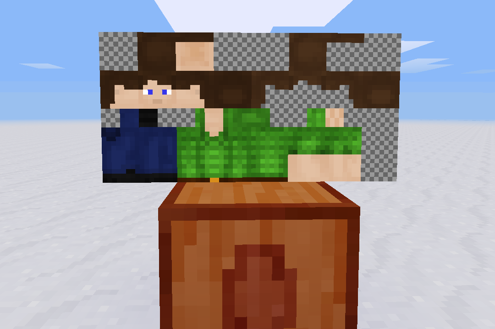
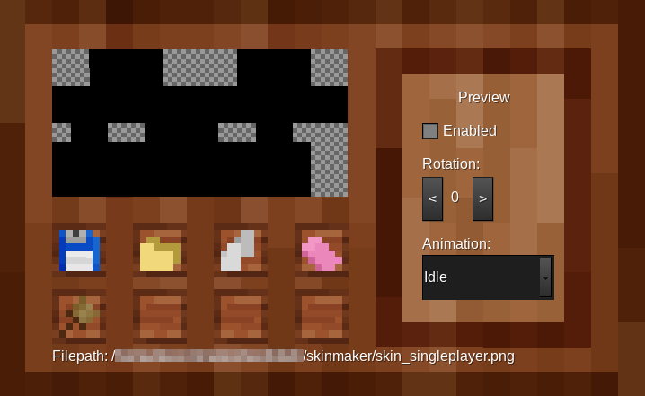
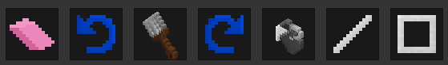
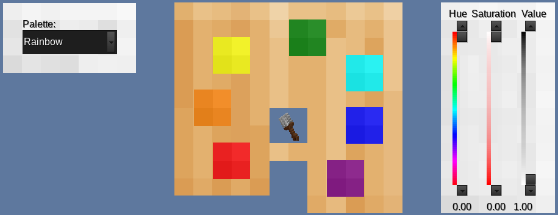

# Skinmaker #

**Skinmaker** is a live, in-game, player skin editor that can be used without server restarts. Images are saved, loaded, and applied live.

## Usage ##
None of the skinmaker items or tools are craftable. This mod is not exactly server-friendly (even though we all wish it was). A single node is provided to obtain all the tools needed.  

### Maker Node ###
The maker node is used to spawn the working canvas (shown in the top screenshot). Upon placing, a canvas will be placed above the node with a solid black skin texture. Note, the canvas will always be rotated in the same direction regardless of placement.  

Right-clicking the maker node will reveal the maker form.  
  
This form includes all the tools needed to begin creating and editing skins. Note, the skin preview in the form is *not* the working canvas.  

The form buttons from left to right and down are as follows:  
`Save`: Saves the current canvas to a PNG file at the specified filepath (shown at the bottom of the form). The filepath cannot be changed as of now, and saving will override any existing file of the same name.  
`Load`: Puts the player's current skin on the canvas.*  
`Apply`: Applies the current canvas to the player.  
`Clear`: Reverts the canvas back to the starting state.*  
`Tools`: Adds the skinmaker toolset to the player's inventory. These tools are required to work with the canvas. Obtaining these items from the creative inventory could result in unexpected behavior.  

\* These actions are irreversable (cannot be undone).

### Tools ###
There are currently 7 tools that can be used on the canvas.   

`Eraser`: Set a pixel to transparent.  
`Paintbrush`: Set a pixel to a specified color.  
`Undo`: Undo the last action (can store up to 100 actions).  
`Redo`: Redo the next action (new actions will clear the redo queue).  
`Bucket`: Fill a color with another.  
`Line`: Create a line from one pixel to another (requires 2 uses to create).  
`Rectangle`: Create a solid rectangle with corners at 2 pixels (requires 2 uses to create).  

### Color Selection ###
Tool color is chosen by right-clicking with the tool, either on the canvas or elsewhere.  

Right-clicking the canvas will act as an eyedropper and set the tool to the pixel color you click on. Only the bucket can be set to transparent.  

Right-clicking elsewhere will show the palette form.  

The palette contains up to 7 colors and a set of HSV sliders. Using the sliders or clicking on a color swatch will set the tool's color. The selected palette can be changed in the dropdown to the left.  

#### Custom Palettes ####
Obtaining a palette from the creative inventory or through `/giveme skinmaker:palette` will allow you to create and share your own color palettes.  

Customization is done by right-clicking with the palette. A form similar to color selection is shown, with a name field rather than a palette dropdown. Use the sliders to adjust the color preview in the middle, and click on a swatch to set it's color (this will override the current color, if any). Palettes do not need to fill all the colors.  

When using the color selection form, any non-empty palettes in your inventory will be added to the dropdown.  

### Skin Preview ###
The maker form contains settings pertaining to the skin preview. Enabling the preview will place a mini player entity in front of the maker node. The entity can rotate in either direction at multiple speeds, and can be animated. The texture will update along with the canvas.  

## How does this work? ##
This mod spawned from an [experimental mod by Aurailus](https://github.com/Aurailus/tc/) that attempted to allow dynamic creation of textures at runtime. This mod is limited to 16x16 textures due to the method used and the limitations of the Minetest engine.  

#### The Gist ####
Each texture is a `[combine` modifier composed of a lot of `[colorize` modifiers, 1568 of them to be exact. This, in turn, creates a massive string that can be used as a texture. Painting is done using `Raycast()`.  

#### The Drawbacks ####
The reason Aurailus' mod is limited to 16x16 is the hard limit on texture modifiers used in nodes. Entities do not share this limit. Entities *do*, on the other hand, have a limit of how large a serialized table can be. If the `textures` table contains more than 65535 bytes, Minetest will silently segfault with no errors (or give a serialization error). For this reason, the pixel image is named `px.png`, in order to keep the string as small as possible. However, even with a short image name, 64x32 (2048) colorize modifiers brings the string size to around 70000 bytes. In order to circumvent this, all unused parts of the skin are left out, bringing the string size down to around 50000 bytes.  

It is worth noting that formspecs do not care how large the generated image is (or the limit is much higher).  

## Should I use this on my server? ##
Probably not. I question the performance of this mod and the stabillity is definitely sub-par.  

That said, if you don't care about the risks, this could potentially be very good for a multiplayer server. The abillity to load skins live is a much missed feature in Minetest. Do note that this mod is not intended to apply new skins, it is simply to make new ones from scratch or edit already applied skins. I may create a sister mod to provide the live-load function.  

## Todo and Bugs ##
#### Todo ####
* An efficient(!) method of exactly viewing which pixel is being pointed at
* Scalable canvas
* Support param2/canvas rotation
* Use invisible placeholder nodes in the canvas and preview to prevent node placement

#### Known bugs ####
* Pointing is not 100% accurate
* Preview enabled with rotation of 0 will not reset yaw when rotation is 0 again  

### Other Info ###
This mod took roughly 4 days to make.  
